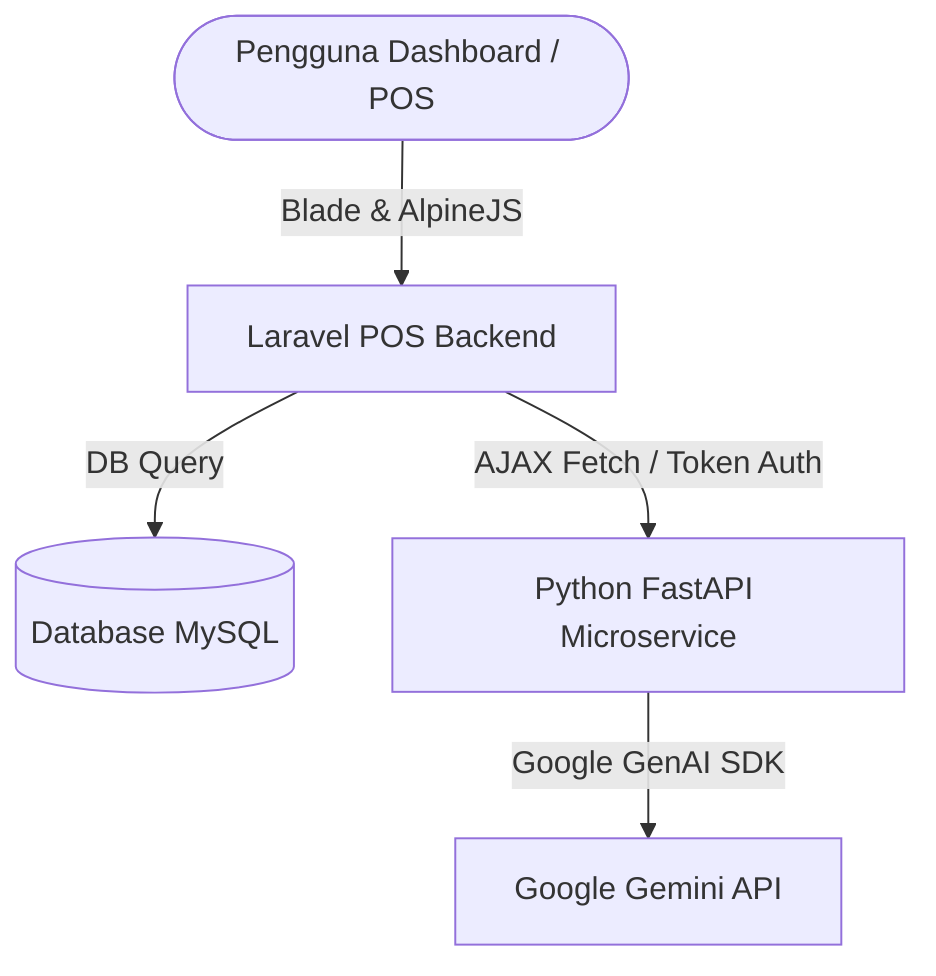

# 📚 DOKUMENTASI LENGKAP PROJEK: LAKUPOS (POS & AI SYSTEM)

Dokumen ini menyajikan panduan komprehensif mengenai **LAKUPOS**, sebuah sistem *Point of Sale* (POS) terintegrasi multi-cabang yang dilengkapi dengan analisis kecerdasan buatan (AI) bertenaga Google Gemini. Dokumen ini ditujukan untuk developer, QA, dan administrator sistem.

---

## 📑 Daftar Isi
1. [Gambaran Umum & Alur Bisnis](#1-gambaran-umum--alur-bisnis)
2. [Arsitektur & Tech Stack](#2-arsitektur--tech-stack)
3. [Arsitektur & Integrasi AI (RAG)](#3-arsitektur--integrasi-ai-rag)
4. [Fitur Chat AI & Autocomplete (Typeahead)](#4-fitur-chat-ai--autocomplete-typeahead)
5. [Instalasi & Panduan Menjalankan Sistem](#5-instalasi--panduan-menjalankan-sistem)
6. [Struktur Kode & Layanan Utama (Services)](#6-struktur-kode--layanan-utama-services)
7. [Struktur Database & Hubungan Entitas](#7-struktur-database--hubungan-entitas)

---

## 1. Gambaran Umum & Alur Bisnis

LAKUPOS dirancang untuk menyederhanakan operasional ritel multi-cabang dengan sistem otorisasi berbasis peran (**Role-Based Access Control / RBAC**):

*   **SuperAdmin / Pemilik Bisnis:** Akses penuh lintas cabang, modul keuangan manajerial, pengaturan pajak/sistem, laporan Laba/Rugi, dashboard AI analisis, serta rekomendasi aksi proaktif.
*   **Admin / Warehouse:** Mengelola data master (produk, kategori, supplier, pelanggan), kontrol gudang, *Stock Opname*, transfer stok antar cabang, dan *Purchase Order* (PO) ke supplier.
*   **Supervisor:** Memantau riwayat penjualan harian, mengawasi kasir, dan menyetujui pembatalan transaksi di cabang bertugas.
*   **Cashier (Kasir):** Hanya mengakses halaman penjualan POS, memproses transaksi kasir, mengelola promo/voucher, serta menginput saldo laci uang lewat sistem buka/tutup shift kasir (*Cash Register*).

### Alur Kerja Inti (Core Workflows)
1.  **POS & Shift Kasir:** Kasir wajib melakukan **Buka Shift** dengan saldo awal sebelum memproses keranjang belanja. Setiap transaksi kasir (*Sale*) otomatis memotong *ProductStock* di gudang cabang terkait, mencatat *StockMovement*, dan menambah saldo kas. Di akhir hari, kasir melakukan **Tutup Shift** untuk mencocokkan fisik kas.
2.  **Purchasing & Supplier Debt:** Produk yang habis dipesan via *Purchase Order* (PO) ke Supplier. Saat barang diterima (*Purchase*), stok bertambah dan sisa tagihan dicatat sebagai *SupplierDebt* (Utang Toko ke Supplier) jika belum dibayar lunas.
3.  **Customer & Piutang:** Pelanggan member mengumpulkan *CustomerPoint* berdasarkan belanjaan. Transaksi non-tunai yang belum dibayar pelanggan dicatat sebagai *CustomerDebt* (Piutang Toko) untuk dilunasi nanti.

---

## 2. Arsitektur & Tech Stack

LAKUPOS mengadopsi arsitektur modular yang memisahkan operasional kasir dari pemrosesan AI analitik:



*   **Backend POS:** Laravel 10/11 (PHP 8.2+) — Menangani seluruh database transaksi, validasi bisnis, otorisasi peran, pencetakan struk, dan eksekusi antrean (Queue).
*   **AI Microservice:** Python 3.10+ (FastAPI) — Mengisolasi beban kerja pemrosesan teks (*prompting*) dan integrasi API eksternal agar tidak membebani server utama Laravel.
*   **Frontend & UI:** Blade Templates, Tailwind CSS (dengan tema modern, glassmorphism), Alpine.js untuk reaktivitas dinamis, dan Chart.js untuk visualisasi grafik laporan.

---

## 3. Arsitektur & Integrasi AI (RAG)

Sistem menggunakan metode **RAG (Retrieval-Augmented Generation)** dinamis. AI tidak mengambil keputusan langsung, melainkan menyajikan data analitik POS secara terstruktur kepada model bahasa untuk dianalisis:

1.  **Context Builder (`AiContextBuilderService.php`):** Mengambil metrik bisnis real-time (omset hari ini, pertumbuhan dibanding kemarin, stok kritis di bawah batas minimum, produk tidak laku/dead stock, laba kotor, HPP, margin keuntungan, jam sibuk, serta data prediksi penjualan WMA 3 bulan dan prediksi stok habis). Data ini dikonversi menjadi format ringkasan teks terstruktur (*Context*).
2.  **Caching Guard:** Konteks disimpan di cache Laravel (`ai_system_context_v2_{user_id}`) selama 5 menit untuk menghindari beban query database (database bottleneck) yang terlalu sering pada sistem multi-cabang.
3.  **Strict Anti-Hallucination Guardrails:** AI diinstruksikan secara ketat melalui *System Instruction* agar **hanya** menjawab menggunakan data riil yang ada pada Konteks. Jika nama produk atau angka keuangan tidak tercantum di konteks, AI akan membalas dengan jujur dan mengarahkan user ke halaman sistem yang bersangkutan demi menjamin **nol halusinasi data**.

---

## 4. Fitur Chat AI & Autocomplete (Typeahead)

Halaman Chat AI dirancang interaktif dan humanis dengan fitur-fitur mutakhir:

### A. Real-time Autocomplete (Typeahead)
Saat pengguna mulai mengetik di input chat, dropdown saran pertanyaan akan muncul di atas kolom input secara real-time.
*   **Pencarian Cerdas:** Memfilter contoh pertanyaan berdasarkan kecocokan teks atau kategori (Penjualan, Stok, Keuangan, Prediksi).
*   **Highlight Teks:** Mewarnai bagian teks yang cocok dengan ketikan pengguna menggunakan tag `<mark>`.
*   **Navigasi Keyboard:** Mendukung tombol `ArrowUp`, `ArrowDown` untuk memilih saran, `Enter` untuk mengirim, dan `Escape` untuk menutup dropdown.

### B. Typewriter Streaming Animation
Untuk memberikan impresi interaksi yang hidup layaknya mengobrol dengan manusia, teks respons asisten AI diketikkan secara bertahap (word-by-word/char-by-char) dengan kecepatan yang adaptif.
*   **Kecepatan Dinamis:** Pesan pendek diketik santai (~15ms per char). Pesan analitik yang panjang secara otomatis diketik lebih cepat (~5ms per char) agar pengguna tidak menunggu terlalu lama.
*   **Grafik Terintegrasi (Chart.js):** Jika jawaban AI membandingkan data numerik (misalnya perbandingan omset bulanan), AI akan menyertakan blok grafik di akhir respons. Grafik ini akan dimuat secara mulus setelah ketikan teks selesai seluruhnya.

### C. 20 Predefined Business Queries
Sistem chat dioptimalkan untuk menjawab 20 domain pertanyaan bisnis berikut secara akurat:
1.  *Berapa omset hari ini?*
2.  *Produk apa yang paling laris bulan ini?*
3.  *Bandingkan penjualan bulan ini dengan bulan lalu*
4.  *Jam berapa yang paling sibuk hari ini?*
5.  *Siapa pelanggan yang paling banyak berbelanja?*
6.  *Berapa total transaksi bulan ini?*
7.  *Berapa rata-rata nilai transaksi bulan ini?*
8.  *Produk mana yang stoknya kritis atau hampir habis?*
9.  *Produk apa yang tidak laku 30 hari terakhir (dead stock)?*
10. *Berapa total produk aktif saat ini?*
11. *Berapa stok produk tertentu saat ini?*
12. *Berapa laba kotor bulan ini?*
13. *Berapa total HPP (Harga Pokok Penjualan) bulan ini?*
14. *Berapa total utang toko ke supplier?*
15. *Metode pembayaran apa yang paling sering digunakan?*
16. *Berapa margin keuntungan bulan ini?*
17. *Prediksi omset bulan depan berdasarkan tren 3 bulan terakhir*
18. *Produk mana yang stoknya diprediksi akan habis paling cepat?*
19. *Berikan rekomendasi bundling produk yang sering dibeli bersama*
20. *Apa tren penjualan dalam 3 bulan terakhir?*

---

## 5. Instalasi & Panduan Menjalankan Sistem

### A. Prasyarat (Requirements)
*   PHP >= 8.2 dengan ekstensi pdo, gd, zip, bcmath, ctype.
*   Composer.
*   Node.js & NPM (untuk aset Vite).
*   MySQL >= 8.0.
*   Python >= 3.10 (untuk AI Microservice).

### B. Setup Backend Laravel
1.  Clone repository projek ini ke server lokal Anda.
2.  Install dependensi PHP:
    ```bash
    composer install
    ```
3.  Salin file environtment dan lakukan konfigurasi:
    ```bash
    cp .env.example .env
    ```
    *Sesuaikan nilai database `DB_DATABASE`, `DB_USERNAME`, `DB_PASSWORD`.*
4.  Jalankan migrasi database beserta seeder datanya:
    ```bash
    php artisan migrate --seed
    ```
5.  Install dan build dependensi frontend:
    ```bash
    npm install
    npm run build
    ```
6.  Jalankan server lokal Laravel:
    ```bash
    php artisan serve
    ```

### C. Setup AI Microservice (Python)
1.  Buka direktori `/ai_microservice`.
2.  Buat environment Python dan aktifkan:
    ```bash
    python -m venv venv
    # Windows:
    .\venv\Scripts\activate
    # Linux/Mac:
    source venv/bin/activate
    ```
3.  Install dependensi pustaka Python:
    ```bash
    pip install -r requirements.txt
    ```
4.  Salin `.env.example` ke `.env` di folder microservice dan isi nilai `GEMINI_API_KEY` Anda dengan kunci dari Google AI Studio.
5.  Jalankan server FastAPI:
    ```bash
    uvicorn main:app --reload --port 8001
    ```
6.  Pastikan file `.env` Laravel utama Anda merujuk ke url microservice:
    ```env
    AI_MICROSERVICE_URL=http://127.0.0.1:8001
    AI_MICROSERVICE_TOKEN=super-secret-ai-token
    ```

---

## 6. Struktur Kode & Layanan Utama (Services)

Aplikasi POS ini menerapkan pemisahan logika yang bersih (*clean code*) dengan membagi fungsionalitas ke dalam service-oriented classes:

*   **`App\Services\Ai\AiContextBuilderService`:** Bertanggung jawab menyusun seluruh data mentah dari database (penjualan, HPP, inventaris, log aktivitas) menjadi narasi teks ringkasan untuk bahan bacaan RAG Gemini.
*   **`App\Services\Ai\AiFallbackService`:** Berfungsi sebagai mesin analisis lokal berbasis pola (*rule-based engine*). Jika API Key Gemini habis atau microservice mati, kelas ini otomatis mengambil alih respons chat untuk menjawab 20 pertanyaan analisis dengan data akurat hasil query database lokal tanpa lag.
*   **`App\Services\Ai\GeminiService`:** Penghubung langsung ke API Google Gemini jika microservice dilewati, mengirimkan instruksi sistem beserta data RAG secara aman.
*   **`App\Services\Analytics\SalesAnalyticsService`:** Menghitung metrik penjualan harian, mingguan, bulanan, grafik komparasi, serta kalkulasi rekomendasi produk terlaris.
*   **`App\Services\Analytics\InventoryAnalyticsService`:** Menganalisa tingkat kesehatan stok produk (healthy, low, out of stock) serta menghitung prediksi hari sisa sebelum stok habis.

---

## 7. Struktur Database & Hubungan Entitas

Sistem ini didukung oleh database relasional yang dinormalisasi dengan relasi sebagai berikut:

*   **`branches` & `warehouses`:** Setiap cabang memiliki satu atau beberapa gudang penyimpanan.
*   **`products` & `product_stocks`:** Tabel `products` hanya menyimpan metadata produk (nama, SKU, harga beli, harga jual, min_stock). Tabel `product_stocks` mencatat sisa stok riil per `product_id` di masing-masing `warehouse_id`.
*   **`sales` & `sale_items` & `payments`:** Mencatat transaksi POS. `sales` menyimpan invoice, diskon, dan grand total. `sale_items` mencatat produk dan kuantitas terjual. `payments` mencatat metode pembayaran.
*   **`purchases` & `purchase_items` & `supplier_debts`:** Mencatat PO dan pembelian barang masuk dari supplier, serta melacak tagihan utang toko yang belum lunas.
*   **`cash_registers` & `cash_movements`:** Melacak saldo shift kasir saat ini serta pencatatan pengeluaran operasional toko.
