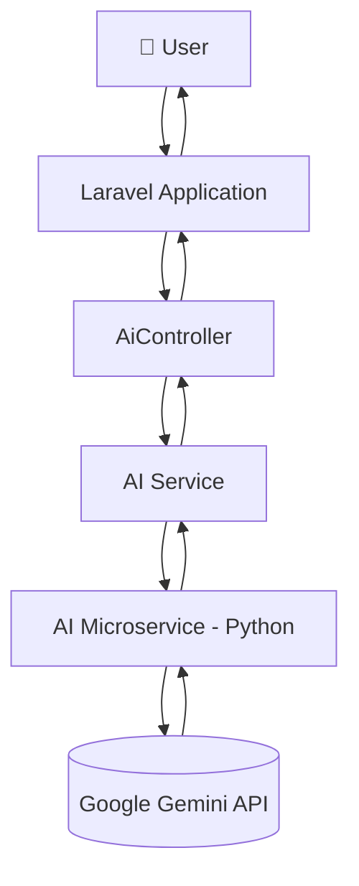

# 🛒 LAKUPOS — POS System with AI Integration

**Sistem Point of Sale (POS) berbasis Laravel dengan AI Assistant bertenaga Google Gemini**

Kelola penjualan, inventory, pelanggan, supplier, dan kas — sekaligus dapatkan analisis bisnis
otomatis lewat AI yang memahami data toko Anda secara *real-time*.


---

## 📑 Daftar Isi

- [Fitur Utama](#-fitur-utama)
- [Arsitektur AI](#-arsitektur-ai)
- [Tech Stack](#️-tech-stack)
- [Requirements](#-requirements)
- [Instalasi](#-instalasi)
- [Konfigurasi Environment](#️-konfigurasi-environment)
- [Konfigurasi Database](#️-konfigurasi-database)
- [Konfigurasi Gemini API](#-konfigurasi-gemini-api)
- [AI Microservice](#-ai-microservice)
- [Menjalankan Aplikasi](#️-menjalankan-aplikasi)
- [Menjalankan Queue](#-menjalankan-queue)
- [Struktur Project](#-struktur-project)
- [Testing](#-testing)
- [Keamanan](#-keamanan)
- [Git Workflow](#-git-workflow)
- [Dokumentasi](#-dokumentasi)
- [Roadmap](#️-roadmap)
- [Kontribusi & Lisensi](#-kontribusi--lisensi)

---

## ✨ Fitur Utama

<table>
<tr>
<td width="50%" valign="top">

### 🧾 Point of Sale
- Transaksi penjualan & keranjang belanja
- Scan barcode
- Cetak struk
- Riwayat transaksi
- Retur penjualan
- Manajemen kasir

### 📦 Inventory Management
- Manajemen produk & stok
- Stock movement & adjustment
- Peringatan stok minimum
- Purchase / pembelian
- Manajemen supplier
- Transfer stok antar cabang

</td>
<td width="50%" valign="top">

### 👥 Customer Management
- Data & tipe member pelanggan
- Piutang pelanggan (customer debt)
- Riwayat transaksi per pelanggan

### 💵 Cash Management
- Cash register & cash movement
- Pemasukan & pengeluaran
- Saldo kas real-time

### 📊 Dashboard & Report
- Dashboard penjualan
- Laporan transaksi, stok, & pembelian
- Laporan pelanggan
- Analisis performa bisnis

</td>
</tr>
</table>

### 🤖 AI Assistant

Ditenagai oleh **Google Gemini API**, AI Assistant membantu:

| Kemampuan | Deskripsi |
|---|---|
| 💬 Tanya jawab bisnis | Menjawab pertanyaan operasional dalam bahasa natural |
| 📈 Analisis penjualan | Menganalisis tren dan performa penjualan |
| 🔍 Insight produk | Memberi insight produk terlaris & kurang laku |
| 📦 Analisis stok | Membantu memantau kesehatan inventaris |
| 💡 Rekomendasi bisnis | Memberi saran strategis berbasis data |
| 🗂️ Data-driven answers | Menjawab berdasarkan data riil dari sistem POS |
| 💾 Riwayat percakapan | Menyimpan histori percakapan AI |

---

## 🧠 Arsitektur AI



> Alur singkat: permintaan pengguna diproses Laravel → diteruskan ke AI Microservice (Python/FastAPI)
> → dikirim ke Gemini API → respons dikembalikan berlapis hingga tampil ke pengguna.

---

## 🛠️ Tech Stack

| Layer | Teknologi |
|---|---|
| **Backend** | PHP, Laravel, MySQL, Eloquent ORM, Laravel Queue & Jobs |
| **Frontend** | Blade, Bootstrap/CSS, JavaScript |
| **AI** | Google Gemini API, Python, AI Microservice (FastAPI) |
| **Tooling** | Git, GitHub, Composer, NPM |

---

## 📋 Requirements

Pastikan tools berikut sudah terpasang sebelum memulai:

- ✅ PHP **8.2+**
- ✅ Composer
- ✅ Node.js & NPM
- ✅ MySQL
- ✅ Python **3.10+**
- ✅ Git

Cek versi sekaligus:

```bash
php -v && composer -V && node -v && npm -v && python --version && git --version
```

---

## 📥 Instalasi

```bash
# 1. Clone repository
git clone <URL_REPOSITORY>

# 2. Masuk ke directory project
cd POS

# 3. Install dependency Laravel
composer install

# 4. Install dependency frontend
npm install
```

---

## ⚙️ Konfigurasi Environment

Salin file environment contoh:

```bash
# Windows
copy .env.example .env

# Linux / macOS
cp .env.example .env
```

Generate application key:

```bash
php artisan key:generate
```

---

## 🗄️ Konfigurasi Database

Edit bagian koneksi database di `.env`:

```env
DB_CONNECTION=mysql
DB_HOST=127.0.0.1
DB_PORT=3306
DB_DATABASE=pos
DB_USERNAME=root
DB_PASSWORD=
```

Jalankan migrasi:

```bash
php artisan migrate
```

Jika project menggunakan seeder, jalankan salah satu:

```bash
php artisan db:seed
# atau sekaligus
php artisan migrate --seed
```

---

## 🤖 Konfigurasi Gemini API

Project ini menggunakan **Google Gemini** sebagai Large Language Model.

1. Buat API key melalui **[Google AI Studio](https://aistudio.google.com/app/apikey)**
2. Tambahkan ke file `.env`:

```env
GEMINI_API_KEY=your_api_key_here
```

> ⚠️ **Penting:** jangan pernah commit API key asli ke repository.
> Pastikan `.env.example` hanya berisi key kosong:
> ```env
> GEMINI_API_KEY=
> ```

---

## 🧪 AI Microservice

Microservice Python terpisah untuk menangani seluruh proses AI, berada di folder:

```text
ai_microservice/
├── app/
├── requirements.txt
└── ...
```

Langkah menjalankan:

```bash
# 1. Masuk ke directory microservice
cd ai_microservice

# 2. Buat virtual environment
python -m venv venv

# 3. Aktifkan virtual environment (Windows)
venv\Scripts\activate

# 4. Install dependency
pip install -r requirements.txt

# 5. Jalankan microservice (contoh dengan FastAPI)
uvicorn main:app --reload
```

---

## ▶️ Menjalankan Aplikasi

**Server Laravel:**

```bash
php artisan serve
```

Aplikasi dapat diakses di **http://127.0.0.1:8000**

**Development frontend:**

```bash
npm run dev
```

---

## 🔄 Menjalankan Queue

Jika project menggunakan Laravel Queue untuk proses background:

```bash
php artisan queue:work
```

Queue digunakan untuk proses seperti:

- 🤖 AI processing
- 📄 Generate laporan
- 🔔 Notifikasi
- ⚙️ Proses berat lainnya

---

## 📁 Struktur Project

```text
POS/
│
├── app/
│   ├── Exports/
│   ├── Helpers/
│   ├── Http/
│   │   ├── Controllers/
│   │   ├── Middleware/
│   │   └── Requests/
│   ├── Jobs/
│   ├── Models/
│   └── Services/
│
├── ai_microservice/        # Layanan AI berbasis Python
│
├── config/
│
├── database/
│   ├── migrations/
│   └── seeders/
│
├── docs/
│   ├── PRD_FULL_POS_SYSTEM.md
│   ├── PRD_SUPERADMIN_AI_ANALYSIS_RECOMMENDATION.md
│   └── AI_AGENT_IMPLEMENTATION_RECOMMENDATION.md
│
├── resources/
│   └── views/
│
├── routes/
├── tests/
│
├── .env.example
├── composer.json
└── package.json
```

---

## 🧪 Testing

```bash
# Menjalankan seluruh test
php artisan test

# Menjalankan test tertentu
php artisan test tests/Feature/AiControllerTest.php

# Menjalankan unit test saja
php artisan test tests/Unit/
```

---

## 🔐 Keamanan

- Jangan pernah commit file `.env`
- Pastikan `.gitignore` mencakup:

```gitignore
.env
.env.*
!.env.example

/vendor/
/node_modules/

/storage/*.key
/storage/logs/
/storage/framework/cache/
/storage/framework/sessions/
/storage/framework/views/
```

- API key Gemini **wajib** disimpan sebagai environment variable, **tidak** ditulis langsung di source code:

```env
GEMINI_API_KEY=your_api_key
```

---

## 🌿 Git Workflow

```bash
# 1. Buat branch fitur baru
git checkout -b feature/nama-fitur

# 2. Tambahkan perubahan
git add .

# 3. Commit dengan pesan yang jelas
git commit -m "feat: add new feature"

# 4. Push ke remote
git push origin feature/nama-fitur
```

Alur review sebelum masuk production:

```text
feature → Pull Request → Code Review → develop → Testing → main
```

---

## 📚 Dokumentasi

Dokumentasi lengkap tersedia di folder [`docs/`](docs/):

| Dokumen | Deskripsi |
|---|---|
| [`PRD_FULL_POS_SYSTEM.md`](docs/PRD_FULL_POS_SYSTEM.md) | Spesifikasi lengkap sistem POS |
| [`PRD_SUPERADMIN_AI_ANALYSIS_RECOMMENDATION.md`](docs/PRD_SUPERADMIN_AI_ANALYSIS_RECOMMENDATION.md) | Spesifikasi fitur AI Analysis untuk SuperAdmin |
| [`AI_AGENT_IMPLEMENTATION_RECOMMENDATION.md`](docs/AI_AGENT_IMPLEMENTATION_RECOMMENDATION.md) | Rekomendasi implementasi AI Agent |

---

## 🗺️ Roadmap

- [ ] AI Business Assistant
- [ ] AI Sales Prediction
- [ ] AI Stock Prediction
- [ ] Product Recommendation
- [ ] Automatic Business Insight
- [ ] RAG untuk data bisnis
- [ ] Function Calling / AI Tools
- [ ] Multi-branch management
- [ ] Advanced analytics
- [ ] Dashboard AI untuk SuperAdmin
- [ ] Automated reporting
- [ ] Notification berbasis AI

---

## 👨‍💻 Konsep Pengembangan

Project ini dikembangkan sebagai sistem POS modern yang menggabungkan
**operational management + business intelligence + artificial intelligence**.

```text
POS
 ├── Sales
 ├── Inventory
 ├── Customer
 ├── Supplier
 ├── Cash
 ├── Reports
 │
 └── AI
      ├── Business Analysis
      ├── Recommendation
      ├── Insight
      └── Assistant
```

---

## 📄 Kontribusi & Lisensi

Project ini dibuat untuk kebutuhan pengembangan dan pembelajaran.

> Tambahkan informasi lisensi resmi sesuai kebutuhan sebelum digunakan untuk keperluan production.

<div align="center">

**Made with ❤️ for better retail operations**

</div>
